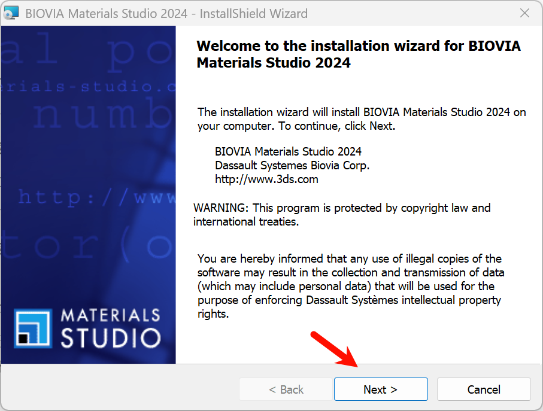

亲测有效 Materials Studio 2024(64bit)下载和安装教程  
第一步：下载安装包  
下载地址在本文最后。  

第二步：安装主程序  
1、下载解压  

下载好需要的安装包并解压，本安装包解压的完整文件有两个文件夹：  

Setup、Crack  

2、开始安装打开Setup文件夹，选择setup.exe文件右单击以管理员身份运行-确认窗口选择：是。  
安装向导，点击next：  
  

用户信息这里随便写，然后点击next：  
  

安装位置，这里我使用默认的地址，你如果想要更改地址，注意不要安装到有中文名称的目录下，以免造成软件bug：  

切换目录使用change按钮，不切换直接next按钮：  
  

安装方式选择完整安装Complete，然后点击Next：  
  

gateway选择默认第一项，直接点next：  
  

点击install按钮就开始安装了：  
  

等待安装完成。  

安装完成后，这里注意要取消勾选配置注册的选项，直接点finish完成。  
  

第三步：激活  
获取计算机全名：右单击开始按钮-选择系统-高级系统设置-计算机名，找到并复制计算机全名，我这里显示的是：ccl  
  

回到最开始的安装文件crack文件中，找到msi2024.lic文件，右单击在记事本中编辑，可以看到最上面的计算机全名几个字，改为自己的计算机名，我的为：ccl，该完毕后一定要保存这个文件（文件菜单-保存）。  
  

保存后复制这个文件，把这个文件粘贴到下面的位置：  

C:\Program Files (x86)\BIOVIA\Materials Studio 24.1\bin  

这个位置就是安装的目录，你安装到那个位置就去找那个位置，我使用的默认位置就是上面这个，把修改好的lic文件复制到这个bin文件夹中，提示需要管理员权限，点击是，完成复制。  

然后从开始按钮-全部程序找到biova文件夹，然后右单击-更多-管理员运行license administrator 2024这个注册管理程序：  
  

打开后进入左侧install license，在右侧browse按钮找到我们上面的复制后的lic文件，默认还是在这个位置：  

C:\Program Files (x86)\BIOVIA\Materials Studio 24.1\bin  
  

选中msi2024.lic文件后，单击打开，回到license administrator 界面，点击install按钮，然后点击ok完成。  

完成后关闭license administrator 界面即可。  

启动测试  
从开始菜单启动主程序：  
  

首次启动显示关联设置界面，表示成功安装：  
  
 

安装包下载方式：  
请关注下面的微信公众号，回复关键词：ms2024  

微信公众号：陈成龙  
  
