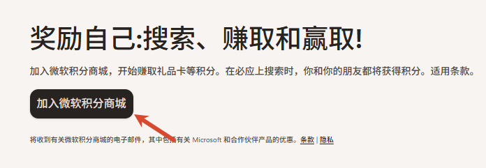
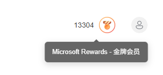
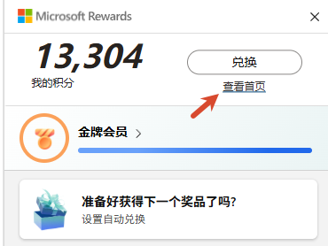
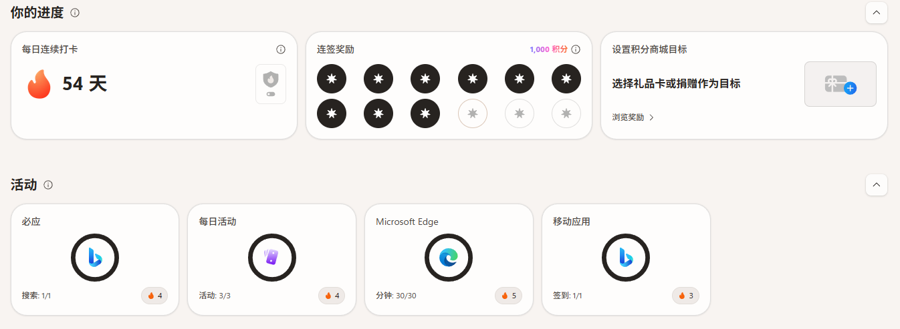
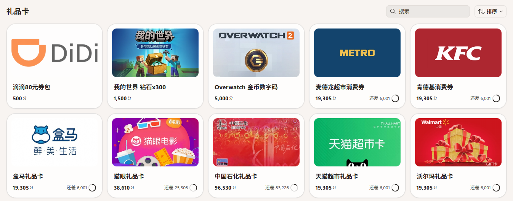

使用edge浏览器的小伙伴都知道bing的积分奖励吧，从最开始的京东购物卡、加油卡的兑换，到现在更多的兑换方式，目前我最喜欢的还是兑换成天猫的购物卡，这样我就实现了我的免费看实体书的自由，我一段时间甚至放弃了微信读书，因为看纸质书更能让我安静、修身养性：  

首先需要注册微软积分商城，点击下面的推荐连接，你可以获得起始的最多1320个积分：

https://rewards.bing.com/welcome?rh=9074B491&ref=rafsrchae

点击立即加入的按钮：   

  

之后在你使用微软的bing搜索的时候，每次搜索都有积分，这个积分是实时增长的，可以在浏览器的右上角看到：

  

那么接下来就是如何最大化积分的收入了，起始点击上图的积分就可以进入这个明细：

点击查看首页：

  
可以看到那些活动是有积分的：

  
总结下来有：

搜索获取

用 Bing 搜索：电脑端搜索、手机端搜索   
通过 Windows 任务栏搜索框 搜索网页   
用 Edge 浏览器 / Edge 手机 App 搜索   
等级越高每日上限越高   

消费/购物获取

在 微软商城（Microsoft Store） 购买游戏、DLC、影视等数字内容   
等级不同返点比例不同：Level 1 = 1:1，Level 2 = 10:1，Level 2 + Game Pass Ultimate = 20:1   
通过 Edge 的 Microsoft Cashback（返现） 在合作零售商购物赚返现   
注意：订阅、礼品卡购买不计积分，每月购物积分上限 20,000 分   

游戏与活动获取

Xbox 玩游戏 或完成 Game Pass 任务/Quest（需满 18 岁，特定市场）   
每日更新的 答题、小测验、trivia 游戏 等 Dashboard 活动   
保持 每日打卡/连续签到（Streak） 拿加成   
Xbox 上完成选定游戏或任务   

那么获取积分如何兑换呢？   

点击顶部的兑换，可以看到这么多可以兑换的：   

   

可以看到，我之前都是兑换的天猫的，兑换后你会收到邮件，邮件中会给你天猫的卡号和密钥，在淘宝app或者天猫上进入天猫超市卡，输入就可以直接兑换为现金了。