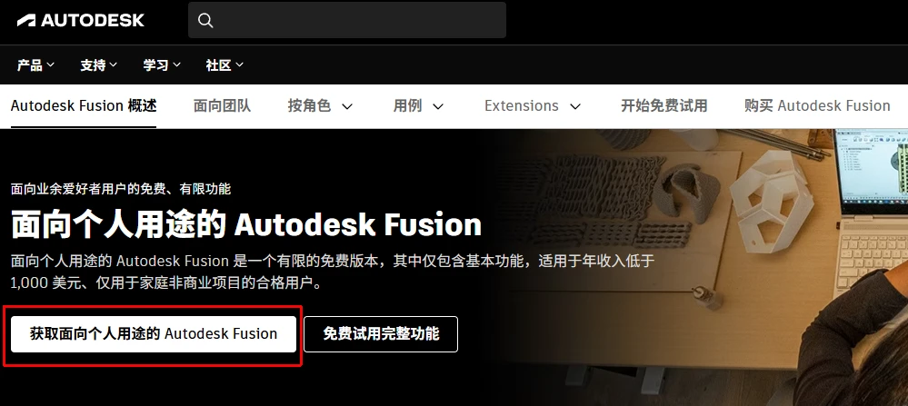

Fusion360最新版下载和安装激活教程
## 下载步骤：
### 方法一：官网下载（网络原因不推荐）
搜索引擎搜：fusion360

定位到Autodesk官方网站，注意不要点到广告网站了！

或者不想自己搜索可以使用直达链接：

https://www.autodesk.com.cn/products/fusion-360/personal

> [!NOTE] 提醒：
> 此链接可能会随着官网更新而失效，如果失效使用搜索即可。

在此页面点击：获取面向个人用途的 Autodesk Fusion 按钮

后续根据提示使用自己的邮箱注册一个Autodesk账户即可。

Autodesk账户是免费注册的！不需要任何费用，可以使用QQ邮箱注册。

注册登录下载即可。

### 方法二：下载离线的安装器（推荐）

方法1对于很多人可能难以实现，因为网络原因，fusion的服务器是在国外的。

那么有一个更快捷的方法就是直接下载我下载好的安装器。

在公众号回复关键词：fusion

即可获得一个名为：Fusion Client Downloader.exe 的安装器，后看只需要双击这个文件，保持联网状态即可自己下载和安装。

安装完毕后即可登录自己注册账号进行使用。

## 激活过程

注意Fusion 360 的激活不需要你操作软件，只需要把自己注册Autodesk的邮箱激活为正版即可。

没有教育邮箱和老师身份的，推荐直接在某宝购买。

## 其他问题

任何问题，比如注册不成功，安装不成功，激活不了都可以私信联系我。